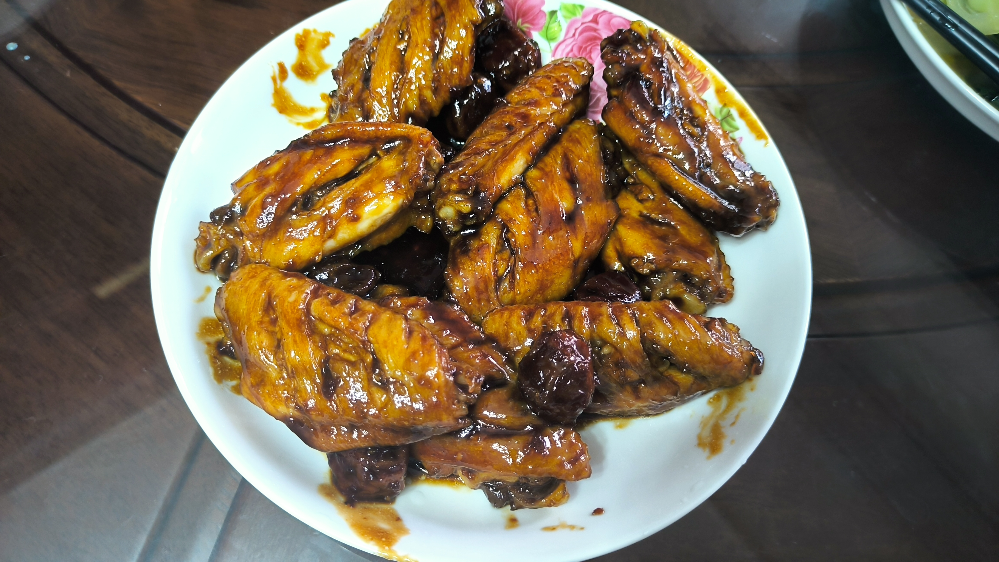

# 可乐鸡翅

## 食材

- 鸡翅 x10
- 可乐适量 (如果使用平底锅大概需要 300ml)
- 话梅 35g
- 冰糖 15g
- 盐 2g
- 老抽 8g
- 油 15g
- 葱姜适量

## 步骤

1. 鸡翅打花刀，一面 3 刀，另一面中间切透。如果鸡翅不新鲜的画，打完花刀可以在姜水中泡一会儿。
2. 鸡翅焯水
   - 鸡翅冷水下锅，水量需要没过鸡翅，水中加入葱姜和料酒去腥。
   - 水开后撇去浮抹，闻一下蒸汽如果是葱姜和料酒的香味即可捞出鸡翅。
3. 起锅，倒入适量油，把锅稍微用油润一下。下鸡翅中小火煎至两面金黄。
4. 倒入可乐，加入话梅 35g、冰糖 15g 和盐 2g，可乐需要没过鸡翅，大火烧开。如果烧开后颜色比较淡，可以加入老抽调色。
5. 撇去浮沫，关小火，盖上盖子焖约 8 分钟。
6. 开盖，鸡翅用筷子插一下不冒血水即可。
7. 开大火，旺火收汁，收到只剩一点糖浆即可出锅。

## 成品

## Reference

- [隋卞一做 |只用一小步？！可乐鸡翅完全不一样！小隋版本的—可乐鸡翅_哔哩哔哩_bilibili](https://www.bilibili.com/video/BV18x4y1z7uc)
