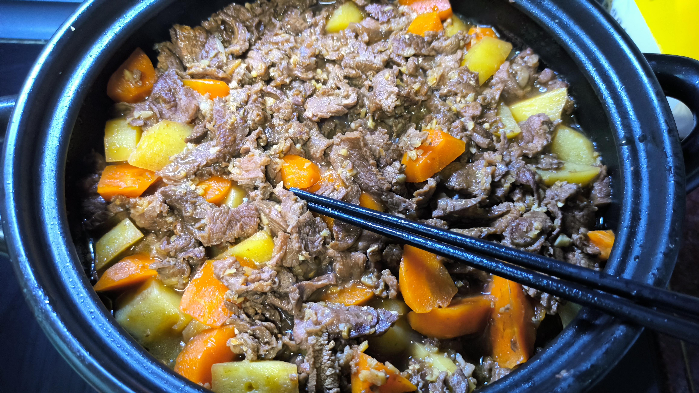

# 土豆胡萝卜炖牛肉

## 食材

- 牛肉 500g
- 土豆 500g
- 胡萝卜 250g
- 蒜姜适量
- 生抽 45g
- 米酒/白酒 30g
- 黑糖 15g

## 准备

1. 提前将牛肉解冻，切小块，焯水去掉血沫和膻气。
2. 土豆去皮，切成滚刀块。
3. 胡萝卜去皮，切成滚刀块。
4. 提前烧好足量热水。
5. 调制好生抽、米酒和黑糖的混合调料，比例为3:2:1。针对一斤牛肉，生抽45g，米酒30g，黑糖15g。可以根据个人口味调整比例。

## 步骤

1. 焯好的牛肉切薄片待用。
2. 锅中放油，放入蒜末和姜片炒香。
3. 加入牛肉片翻炒至变色，加适量料酒翻炒直到炒出香味，将牛肉片盛出备用。
4. 在砂锅中加入土豆块和胡萝卜块，加热水至刚好能没过食材。
5. 大火煮开后，加入牛肉片和调好的生抽、米酒、黑糖混合调料，盖上锅盖，转小火炖煮20~30分钟。

## 小贴士

- 炖牛肉要用热水炖，因为热水可以使牛肉表面蛋白质迅速凝固，防止肉中氨基酸流失，保持肉味鲜美。
- 一定要在水开后加入牛肉片，保持牛肉的鲜嫩。
- 炖煮时使用中小火。
- 加姜片、山楂、茶叶、柠檬、醋都可使牛肉炖的更嫩更软烂。

## 成品

## Reference

- [土豆胡萝卜炖牛肉_百度百科](https://baike.baidu.com/item/%E5%9C%9F%E8%B1%86%E8%83%A1%E8%90%9D%E5%8D%9C%E7%82%96%E7%89%9B%E8%82%89/6132717)
