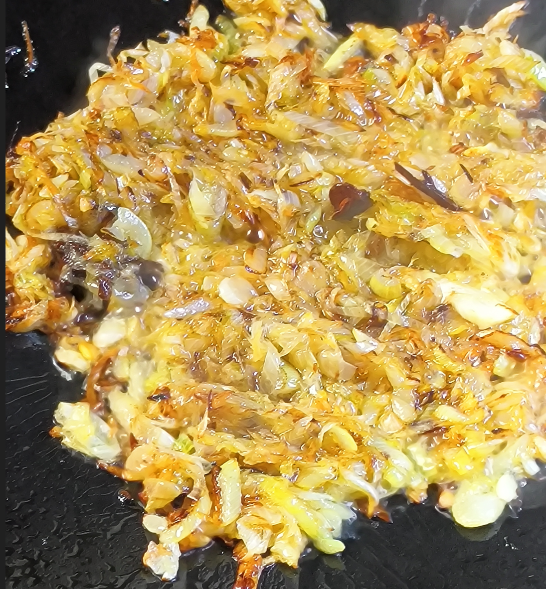
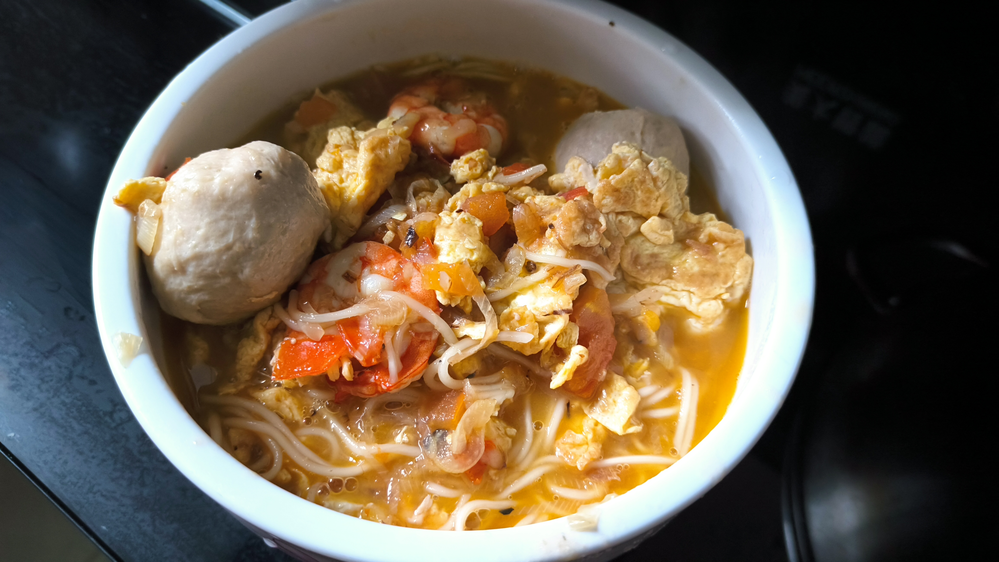

# 炝锅面

## 材料

- 鸡蛋 5 个
- 西红柿 2 个
- 大葱适量 (只选葱白) 150g
- 大料 1 个
- 面饼 3 块
- 开水 1.5L
- 酱油、盐适量

## 步骤

1. 西红柿x2 切丁，放入碗中备用。
2. 大葱切段，切成眉毛葱，放入碗中备用。
3. 鸡蛋打入碗中，搅拌均匀。
4. 锅中下油，大火，油热后加入鸡蛋，油温需要高一些，下去之后能起泡就行。用勺子将鸡蛋扒拉散开，需要炒得稍微焦黄一些，盛出备用。
5. 再次加入油，中火煸葱，注意加入大料，这一步需要耐心，将葱煸至 80% 焦黄变色，有很强的葱香味为止。
   - 实测中小火大概需要煸 5 分钟左右。
6. 加入番茄丁，炒匀，炒出番茄的水分。
7. 烹入一勺酱油，炒匀。
8. 加入鸡蛋，转大火，马上加入足量热水，烧开后盖上锅盖，稍微咕嘟 2~3 分钟，让香味充分融合。
9. 开盖，加盐进行调味。
10. 加入面饼，稍微搅拌一下，盖上锅盖，煮 5 分钟左右，面条熟了即可。

## 关键点

- 炒鸡蛋时油温要高，鸡蛋下去后能起泡，要炒老一点，炒得稍微焦黄一些，鸡蛋的香味才会更浓郁。
- 大葱要擦干净水分，切的时候也要注意不要引入水分，这样在炒的时候才更容易出香味。
- 煸葱时油可以适当加多一些，炸的程度要深一些。

- 炝锅时酱油一定要从锅边淋入，才有炝锅的香味。
- 热水要提前准备好。

## 成品

## Reference

- [隋卞一做 |炝锅面，有手就行……_哔哩哔哩_bilibili](https://www.bilibili.com/video/BV1e8411u7uB)
