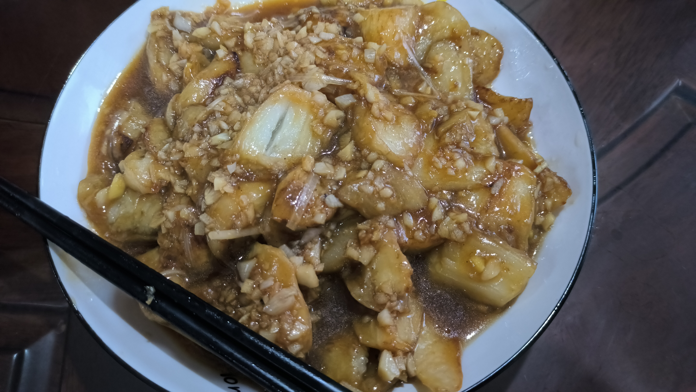

# 烧茄子

## 食材

- 圆茄子 500g
- 葱姜蒜 蒜头 8 个，姜 4\~5 片，大葱 5\~6 厘米
- 玉米淀粉
- 红薯淀粉
- 盐、味精、胡椒粉、香油

## 准备

1. 茄子去皮，切成大片，改刀成鱼鳃块。
2. 茄子下油锅前，茄子撒玉米淀粉，搅拌均匀。
3. 大蒜拍破切碎，用少量水浸泡。
4. 姜切末，用少量水浸泡。
5. 葱切丝。

## 步骤

1. 宽油加热到8成热，下茄子炸透。注意茄子前需要先拍玉米淀粉控干水分。
2. 炸好的茄子捞出，控油。
3. 调制碗芡。
   - 浸泡好的蒜汁的 2/3 ，留 1/3 最后加。
   - 姜汁
   - 葱丝
   - 酱油
   - 红薯淀粉
   - 盐
   - 胡椒粉
   - 味精
   - 糖、醋（可选）
4. 锅留少量底油，茄子回锅，加碗芡和热水，翻炒1分半钟，盛出。
5. 二遍蒜
   - 盛出茄子后的锅底残留；
   - 加入剩下的蒜汁；
   - 加入花生油、香油，酱油；
   - 大火迅速收汁，最后淋在茄子上。

## 小贴士

- 下锅前判断油温，可以用筷子插油锅里看是否有小泡泡，出小泡泡了就下锅炸。
- 二遍蒜末时，翻炒一下不要太久赶紧出锅，蒜末容易糊。
- 炸茄子的时候要不停搅动，什么时候听到漏勺和茄子之间能碰撞出卡尺卡尺的声音就可以捞出来。

## 成品

## Reference

- [家常下饭神器烧茄子！拌面拌饭都一绝，蒜汁儿是真正灵魂~_哔哩哔哩_bilibili](https://www.bilibili.com/video/BV1YP411679f/)
