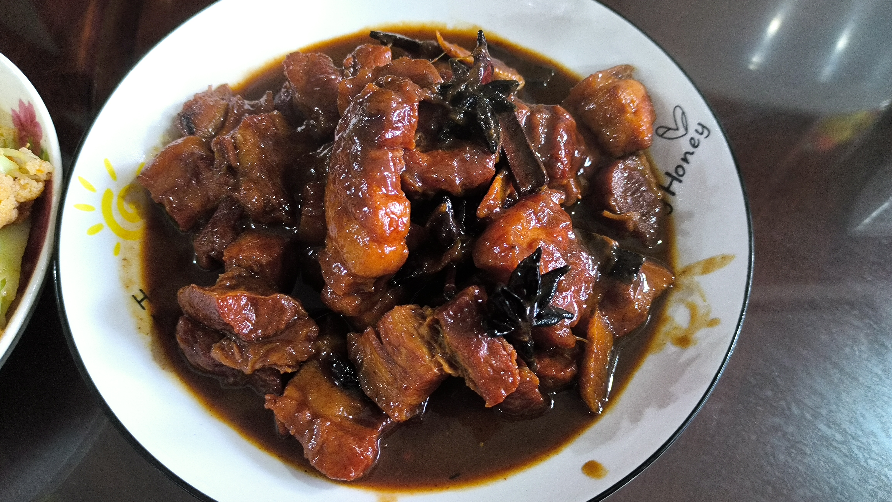

# 腐乳红烧肉

## 食材

- 五花肉 500g
- 大料 3 个
- 桂皮 1 块
- 姜 3 片，大葱适量
- 生抽
- 南腐乳 1 块
- 老抽

## 步骤

1. 五花肉简单焯一下水，去掉血沫，捞出沥干水分。
2. 将五花肉切成大约 2.5 厘米见方的块，家庭做法不需要切太大。

3. 锅中放入一点底油，放入大料 3 个，桂皮 1 块，大火炒香。
4. 下五花肉，大火翻炒，炒出油脂。

5. 将五花肉推至锅边，下葱姜到锅中间，用猪油将葱姜炒香。
6. 煸出葱香味后，将葱姜和五花肉混合在一起，用带有葱姜的猪油炒香五花肉。
7. 炒出足够猪油后，可以酌量将过多的猪油倒出。

8. 转小火，加入生抽 2 汤匙，南腐乳 1 块，如果上色不够，还可以加入适量老抽。将五花肉炒匀。
9. 转大火，加入足量热水，使肉和水平齐。水开后盖上锅盖，稍微咕嘟上 1~2 分钟，让其上色。
10. 加入几粒味精，调味，视口味加入糖、盐或者辣椒。此时的味道就是最终成品的味道。
    - Tips: 这里最好加入几粒冰糖，方便后续收汁粘稠，以及能缓解香料的苦味。
11. 转入压力锅，70kpa 压 10 分钟即可。
12. 最终出锅，大火收汁。

## 成品

## Reference

- [隋卞一做 | 红烧肉但有手就行！_哔哩哔哩_bilibili](https://www.bilibili.com/video/BV1YN41167ad)
