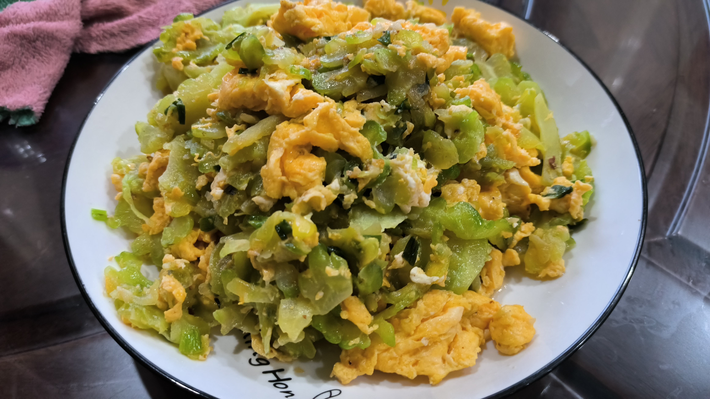

# 苦瓜炒鸡蛋

## 食材

- 苦瓜 500g
- 鸡蛋 4~5 个
- 盐
- 味精
- 耗油
- 姜蒜适量

## 准备

1. 苦瓜洗净切细条，下 2g 盐腌制，搅拌均匀，静置 10 分钟。
2. 鸡蛋打入碗中，搅拌均匀备用。
3. 姜蒜切末备用。

## 步骤

1. 锅热倒油，油热后倒入鸡蛋液，中火炒至断生，盛出备用。
   - 这里需要留一小部分鸡蛋液，待会儿用来和苦瓜混合。
2. 锅中再倒油，放入姜末和蒜末炒香。
3. 倒入腌制好的苦瓜，中火翻炒至苦瓜变色，这一步大概需要 4~5 分钟。
4. 加入适量味精和 1g 盐，翻炒均匀。
5. 将剩余的鸡蛋液均匀倒在苦瓜上，倒下去后不要过度翻炒，可以用锅铲轻轻翻动，让鸡蛋液充分受热凝固。
6. 最后加入炒好的鸡蛋，下一圈耗油，搅拌均匀。
7. 出锅装盘。

## 成品

