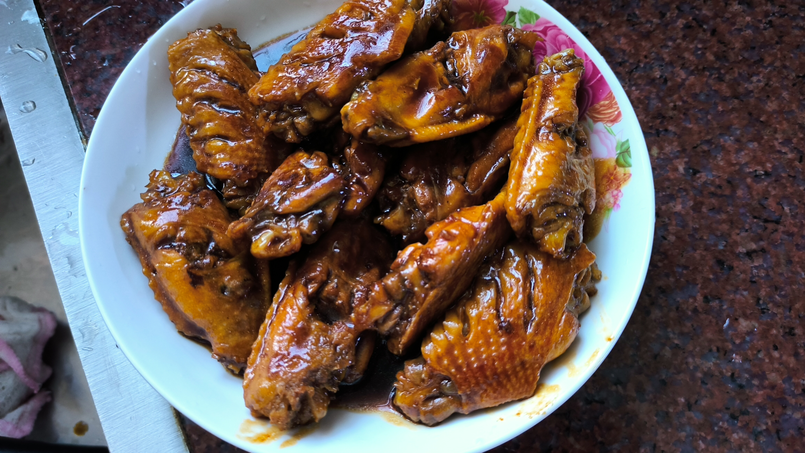

# 蚝油鸡翅

## 食材

- 鸡翅中 500克，约 10~12 个
- 蚝油 15g，大概是一圈的量
- 酱油 15g
- 胡椒粉 1g
- 料酒、葱姜适量
- 老抽适量

## 步骤

1. 鸡翅中洗净，打花刀，一面切 3 刀，另一面切 1 刀。
2. 鸡翅焯水
   - 鸡翅冷水下锅，水量需要没过鸡翅，水中加入葱姜和料酒去腥。
   - 水开后撇去浮抹，闻一下蒸汽如果是葱姜和料酒的香味即可捞出鸡翅。

3. 起锅，倒入适量油，把锅稍微用油润一下。下鸡翅中小火煎至两面金黄。
4. 加入蚝油 15g、酱油 15g，胡椒粉 1g，翻炒均匀。
   - 此处可酌量加入 1~2 个冰糖。
   - 由于耗油成粘稠状不容易散开，可以酌量加入热水方便搅匀。
5. 加入热水，需要没过鸡翅，大火烧开，此时可以加入适量老抽进行调色。
6. 关小火，盖上盖子焖约 8 分钟。
7. 开大火，旺火收汁，收汁至汤汁浓稠即可出锅。

## 成品

