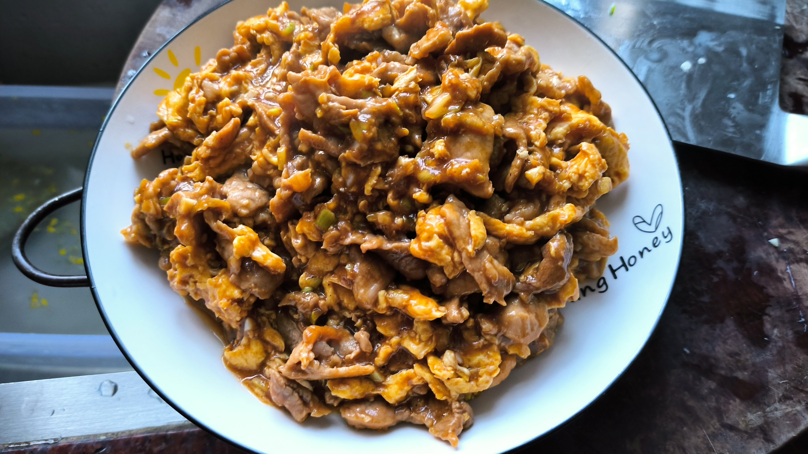

# 醋溜木须

## 原料

- 羊外脊肉 300g , 或者可以换成猪里脊肉
- 鸡蛋 4 个

## 步骤

1. 肉切成薄片，薄一点好熟。
2. 肉腌制，加入酱油 15g , 胡椒粉 1g , 味精 1g , 盐 1g , 揉匀。
3. 肉揉匀后加入水 50g，淀粉 15g
   - 家庭版制作时可以酌量减少水和淀粉的量，即 水 15g，淀粉 5g。
4. 肉揉匀后加入 30g 食用油，这里油适当放多，揉匀。

5. 调制碗芡
   - 米醋 60g (40g) , 家庭版可适量减量。
   - 生抽 40g (30g)
   - 盐 1g
   - 味精 2g
   - 胡椒粉 1g  
   - 水 50g
   - 老抽 5g
   - 淀粉 10g
   - 蒜 30g
   - 葱 20g
   - (可选)香油 10g

6. 油热加入鸡蛋，大火，炒至断生后盛出备用。

7. 锅中重新热油，油热加入葱 30g 和姜 15g , 炸香后捞出葱姜。
8. 然后倒入腌好的肉片，全程中火，肉片 80% 变色后烹入 10g 醋，去腥增香。
9. 马上倒入超好的鸡蛋，再倒入调制好的碗芡，转大火翻炒，等到所有的淀粉凝结附着在肉片表面时，关火出锅。

## 关键点

- 腌制肉时，先加水后加淀粉，是为了锁住水分。
- 腌制肉时，如果肉在冰箱放久了，或者肉稍微老一点，每 1 斤肉加 2g 小苏打，先腌上半小时再制作，肉会足够嫩。
- 碗芡在下锅前需要调匀，因为里面的淀粉放置久了会沉淀。

## 成品

## Reference

- [隋卞一做 |“酸香”到底是什么味道！—醋溜木须_哔哩哔哩_bilibili](https://www.bilibili.com/video/BV1seUSYCE4J)
